# Jarvis — Complete Architecture Diagram

Jarvis is a **personal AI agent** running entirely on localhost. It's a pnpm monorepo with three layers: a shell pipeline that does deterministic work, a Fastify API server that orchestrates Claude processes, and a React dashboard to see everything.

---

## High-Level System Map

```mermaid
graph TB
    subgraph USER["👤 User (the owner)"]
        CHAT["Chat / Voice"]
        BROWSER["Browser Tabs\n(Meet/Zoom/Teams/Webex)"]
    end

    subgraph WEB["🖥️  Web Dashboard  · apps/web · Vite + React · :5173 dev"]
        PAGES["8 Feature Pages\nchat · calls · digest\nactions · brain · overview\nprojects · voice"]
    end

    subgraph SERVER["⚙️  API Server  · apps/server · Fastify · :4321 prod / :4322 dev"]
        ROUTES["Routes Layer\n/api/chat  /api/calls  /api/content\n/api/actions  /api/delegate\n/api/agents  /api/tts"]
        LIVE["WebSocket  /api/live\nliveState.ts\nfs.watch → broadcast"]
        SERVICES["Services Layer"]
        DB["SQLite  data/jarvis.db\nbetter-sqlite3  WAL mode\naction_items table"]
    end

    subgraph AGENTS["🤖  Worker Agents  (spawned claude processes)"]
        DISP["dispatchDelegate()\nrouter"]
        CODE["code agent\nsonnet · branches safely\nnever pushes/merges"]
        ASK["ask agent\nsonnet · read-only\nvaults + projects"]
        NOTE["note agent\nhaiku · write-only\nbrain vault"]
        VOICE["voice agent\nin-process\nwrites memory/voice.txt"]
    end

    subgraph WARM["💬  Warm Session Manager\nchatSessions.ts"]
        SESS["long-lived claude -p process\nstream-json I/O\n15-min idle kill\nauto-resume across restarts"]
    end

    subgraph TOOLS["🔧  Shell Pipeline  · tools/  (no LLM, deterministic)"]
        SCAN["scan-projects.sh\ngit activity scanner\n→ reports/raw-DATE.md"]
        DIGEST["run-digest.sh\nheadless digest runner\n(calls scan + claude)"]
        VAULTSEARCH["vault-search.sh\ngrep over your vaults\n+ snippet ranking"]
        CALLWATCH["call-watch.sh\ncall detector daemon\npolls browser tabs every 15s\nUSR1=stop · USR2=start"]
        PROCESSCALL["process-call.sh\ntranscribe + summarize\nwhisper.cpp + Sonnet"]
        MERGETR["merge-transcripts.py\naligns Me/Them channels\nby timestamp"]
    end

    subgraph CAPTURE["🎙️  Audio Capture  · tools/call-capture/"]
        AUDIOCAP["audiocap.swift\nScreenCaptureKit\nsystem audio → system.wav"]
        MICCHECK["miccheck.swift\nreports mic-in-use process"]
        FFMPEG["ffmpeg\n48kHz stereo → 16kHz mono\nsystem16.wav"]
    end

    subgraph FS["📁  File System  (source of truth — Markdown)"]
        REPORTS["reports/\n  raw-DATE.md\n  digest-DATE.md\n  call-notes-STAMP.md\n  calls/STAMP/\n    mic.wav · system.wav\n    transcript.md · meta.txt\n    FAILED.txt · process.log"]
        MEMORY["memory/\n  about-me.md\n  active-projects.md\n  autorecord.txt\n  voice.txt · voices.txt\n  vaults.txt\n  whisper-model.txt"]
        MODELS["models/\n  ggml-medium.bin\n  ggml-small.bin\n  (whisper.cpp weights)"]
        SECRETS["secrets/.env\n(gitignored)\nELEVENLABS_API_KEY\nELEVENLABS_VOICE_ID"]
    end

    subgraph VAULTS["🧠  Obsidian Vaults  (second brain)"]
        WORK["your vaults (memory/vaults.txt)\ntools · workflows · notes"]
        PROJECTS["projects vault (optional)\none .md per project\ncategory + status frontmatter\n[[wikilinks]] graph"]
        BRAIN["brain/ (brain vault)\n  Calls/ — call notes mirrored here\n  topic .md files auto-updated\n  by note agent"]
    end

    subgraph EXTERNAL["☁️  External APIs"]
        CLAUDE_API["Anthropic Claude API\nsonnet · haiku · opus"]
        ELEVENLABS["ElevenLabs TTS\nturbo_v2_5\nvoice streaming"]
        GCAL["Google Calendar\n(read via claude tool)"]
    end

    subgraph SCHED["⏰  Scheduling  · macOS launchd"]
        PLIST_DIGEST["com.jarvis.digest.plist\n8am daily → run-digest.sh"]
        PLIST_WATCH["com.jarvis.callwatch.plist\nkeep call-watch.sh running"]
    end

    %% User ↔ Web
    USER -->|"types / speaks"| WEB
    WEB -->|"SSE stream\nHTTP REST"| SERVER

    %% Web ↔ Server live channel
    WEB <-->|"WebSocket\n{type:'fs',at:…}"| LIVE

    %% Server internal
    ROUTES --> SERVICES
    SERVICES --> DB
    SERVICES --> WARM
    SERVICES --> DISP

    %% Dispatch to agents
    DISP -->|"type:code"| CODE
    DISP -->|"type:ask"| ASK
    DISP -->|"type:note"| NOTE
    DISP -->|"type:voice"| VOICE

    %% Warm session talks to Claude
    SESS <-->|"stream-json stdin/stdout"| CLAUDE_API

    %% Workers talk to Claude
    CODE & ASK & NOTE <-->|"claude -p subprocess"| CLAUDE_API

    %% Worker results fold back
    CODE & ASK & NOTE -->|"recordResult()"| WARM
    NOTE -->|"auto-distill"| BRAIN

    %% Agents read vaults
    ASK -->|"--add-dir"| VAULTS
    CODE -->|"--add-dir project path"| PROJECTS

    %% TTS
    ROUTES -->|"POST /api/tts"| ELEVENLABS
    ELEVENLABS -->|"audio/mpeg stream"| WEB

    %% Tools pipeline
    SCAN --> REPORTS
    DIGEST -->|"triggers"| SCAN
    DIGEST -->|"claude sonnet"| CLAUDE_API
    DIGEST --> REPORTS
    VAULTSEARCH -->|"grep"| VAULTS

    %% Call pipeline
    BROWSER -->|"meeting URL detected"| CALLWATCH
    CALLWATCH -->|"spawns"| AUDIOCAP
    CALLWATCH -->|"checks"| MICCHECK
    AUDIOCAP --> REPORTS
    CALLWATCH -->|"triggers on hang-up"| PROCESSCALL
    PROCESSCALL -->|"whisper.cpp"| MODELS
    PROCESSCALL -->|"ffmpeg resample"| FFMPEG
    FFMPEG --> REPORTS
    PROCESSCALL -->|"merge-transcripts.py"| MERGETR
    PROCESSCALL -->|"claude sonnet notes"| CLAUDE_API
    PROCESSCALL --> REPORTS
    PROCESSCALL --> BRAIN

    %% Server signals call-watch
    ROUTES -->|"pkill USR1/USR2"| CALLWATCH

    %% Server reads file system
    SERVICES -->|"reads"| FS
    SERVICES -->|"reads"| VAULTS
    SERVICES -->|"reads"| SECRETS

    %% Memory
    VOICE -->|"writes"| MEMORY
    NOTE -->|"writes"| BRAIN
    CALLWATCH -->|"reads autorecord.txt"| MEMORY

    %% Scheduling
    SCHED -->|"launchctl"| TOOLS

    %% Filesystem → live push
    FS -->|"fs.watch"| LIVE
```



---

## Component Breakdown

### 1 · Web Dashboard (`apps/web` — React + Vite)

| Feature | Route | What it shows |
|---------|-------|---------------|
| **chat** | `/` | Streaming SSE chat + voice playback (TTS) |
| **calls** | `/calls` | Call list with status, notes, action-item checkboxes |
| **actions** | `/actions` | Unified inbox of all `- [ ]` items across call notes |
| **digest** | `/digest` | Daily morning brief (latest or by date) |
| **brain** | `/brain` | Force-directed knowledge graph of vault wikilinks |
| **overview** | `/overview` | Stats dashboard (commits, projects, notes, links) |
| **projects** | `/projects` | Project cards from the projects vault |
| **voice** | `/voice` | Voice switcher (ElevenLabs presets from voices.txt) |

The web app uses **React Query** (5s stale time) for all data, and a **WebSocket** connection to `/api/live` to refetch when the server detects filesystem changes — replacing all the old polling loops.

---

### 2 · API Server (`apps/server` — Fastify + TypeScript)

**Port:** 4321 (prod / serves built React app) · 4322 (dev, Vite proxies to it)

#### Routes

| Route | Handler | Notes |
|-------|---------|-------|
| `POST /api/chat` | `chatRoutes` | SSE stream via warm claude session |
| `GET /api/warmup` | `chatRoutes` | Pre-warms a claude session |
| `POST /api/delegate` | `chatRoutes` | Spawns a worker agent |
| `GET /api/agents` | `chatRoutes` | List all running/finished agents |
| `GET /api/calls` | `callRoutes` | Lists all call sessions from `reports/calls/` |
| `GET /api/recstate` | `callRoutes` | Is a call currently recording? |
| `POST /api/calls/toggle` | `callRoutes` | Toggle `- [ ]` checkbox in notes + vault |
| `POST /api/calls/startrec` | `callRoutes` | Sends `USR2` to call-watch daemon |
| `POST /api/calls/stoprec` | `callRoutes` | Sends `USR1` to call-watch daemon |
| `GET /api/content/digest` | `contentRoutes` | Read digest markdown |
| `GET /api/content/graph` | `contentRoutes` | Knowledge graph nodes + links |
| `GET /api/actions` | `actionRoutes` | All action items (from SQLite index) |
| `POST /api/tts` | `chatRoutes` | Proxy to ElevenLabs TTS → audio/mpeg |
| `GET /api/live` | WebSocket | Push `{type:'fs'}` on filesystem changes |

All write endpoints are guarded by `localOnly` (rejects non-127.0.0.1 requests).

#### Services

```
chatSessions.ts  — warm claude session pool (one process/conversation, 15-min idle kill)
agents.ts        — worker agent spawner + registry (code / ask / note / voice)
calls.ts         — filesystem reader for call sessions; toggle + delete
actions.ts       — SQLite index builder from call-notes markdown
digest.ts        — filesystem reader for digest files
graph.ts         — vault wikilink crawler → force-directed graph data
projects.ts      — projects vault reader (frontmatter: category, status)
stats.ts         — aggregates graph + projects + raw reports into overview stats
env.ts           — locates claude binary, reads secrets/.env, voice preferences
```

#### Database (`data/jarvis.db` — SQLite via better-sqlite3)

> **Not a source of truth.** The `action_items` table is a queryable index rebuilt from `call-notes-*.md` whenever the files change. Losing it costs nothing — drop and rebuild.

```sql
CREATE TABLE action_items (
  call_id      TEXT,    -- matches the call session stamp
  idx          INTEGER, -- checkbox index within the notes file
  owner        TEXT,    -- "Owner:" prefix parsed from "- [ ] Owner: task"
  text         TEXT,
  done         INTEGER, -- 0 | 1
  call_title   TEXT,
  call_started TEXT,
  PRIMARY KEY (call_id, idx)
);
```

---

### 3 · Warm Session Manager (chatSessions.ts)

```
User message
    │
    ▼
withPendingContext()  ← injects worker results that came back since last turn
    │
    ▼
claude -p --verbose --input-format stream-json --output-format stream-json
       --include-partial-messages --model sonnet
       --resume <sessionId>           ← resumes across server restarts
       --append-system-prompt CONCISE ← "you are a DISPATCHER, no tools"
       --disallowedTools Bash,Read,Edit,Write,...
    │
    ▼ stream-json events on stdout
    │   content_block_delta → SSE data: "text chunk"
    │   result             → SSE event: done
    ▼
Browser receives spoken answer OR ACTION:DELEGATE JSON
```

When claude emits `ACTION:DELEGATE {"type":"ask","task":"..."}`:
- The **web client** POSTs to `/api/delegate`
- The server calls `dispatchDelegate()` → spawns the right worker
- Worker result is stored via `recordResult()`, folded in on the **next** user turn

**Session persistence:** session UUIDs are stored in `data/sessions.json`. On server restart, existing UUIDs are resumed with `--resume` so memory survives restarts. If the on-disk session is gone, the UUID is dropped and a fresh session starts.

---

### 4 · Worker Agents (agents.ts)

Three kinds of autonomous `claude` subprocesses, each with tightly scoped permissions:

| Kind | Model | Writes to | Safety rules |
|------|-------|-----------|--------------|
| **code** | sonnet | project branch only | Creates `agent/<slug>` branch; never pushes/merges/force-pushes |
| **ask** | sonnet | nothing | Read-only; vaults + projects + tools/*.sh |
| **note** | haiku | brain vault only | Skips trivial facts; appends dated bullets |
| **voice** | (in-process) | `memory/voice.txt` | Looks up preset from voices.txt |

After every `code` or `ask` completion → `autoDistill()` silently spawns a **note** agent to persist the result.

---

### 5 · Call Recording Pipeline

```
Browser tab: meet.google.com/xxx-yyy  AND  mic in use
         │
         ▼  (poll every 15s, AppleScript)
call-watch.sh
    │  starts recording
    ├─► audiocap.swift  (ScreenCaptureKit)  ── system audio ──► system.wav
    ├─► sox rec --rate 16000 --channels 1   ── mic audio    ──► mic.wav
    └─► macOS notification "Recording…"
         │
         │  call ends (tab closes or N misses)
         │  sends SIGTERM to audiocap + sox
         ▼
    writes meta.txt (url, started, ended)
         │
         ▼
process-call.sh  <session-dir>
    ├─ ffmpeg: system.wav → system16.wav (48kHz → 16kHz mono)
    ├─ whisper-cli -m models/ggml-medium.bin mic.wav     → mic.txt
    ├─ whisper-cli -m models/ggml-medium.bin system16.wav → system.txt
    ├─ merge-transcripts.py (aligns timestamps → transcript.md)
    ├─ deletes raw WAVs (keeps system16.wav for 7-day re-run)
    ├─ claude sonnet (reads transcript, writes call-notes-STAMP.md)
    └─ copies notes to <brain>/Calls/call-STAMP.md
```

**Signals from the server:** `POST /api/calls/startrec` sends `SIGUSR2` to the daemon → starts recording immediately. `POST /api/calls/stoprec` sends `SIGUSR1` → stops and processes.

**Auto-record toggle:** `memory/autorecord.txt` = `on|off`. The daemon reads it every poll — no restart needed.

**Privacy:** Audio never leaves the machine. Only the `claude sonnet` call for note-writing goes to Anthropic (text only). WAVs are deleted after successful transcription; system16.wav is purged after 7 days by the daemon's startup sweep.

---

### 6 · Shell Tools (tools/)

| Script | Purpose |
|--------|---------|
| `scan-projects.sh` | Git activity scanner. Reads `memory/active-projects.md`, emits the owner's commits + branch + dirty state. No network, no LLM. |
| `run-digest.sh` | Headless one-command digest: runs scan → invokes claude to write `digest-DATE.md` |
| `vault-search.sh "query"` | grep over both Obsidian vaults, returns top pages with match counts + snippets |
| `call-watch.sh` | Call detector + recorder daemon (see §5) |
| `process-call.sh <dir>` | Transcribe + summarize a call session (see §5) |
| `merge-transcripts.py` | Aligns two whisper VTT outputs by timestamp into one speaker-labeled transcript |
| `agent.sh` | Thin launcher (used by the launchd plists) |

---

### 7 · File System Layout (source of truth)

```
~/jarvis/
  CLAUDE.md               — instruction manual (read every session)
  memory/
    about-me.md           — who the owner is
    active-projects.md    — repos the digest scans
    autorecord.txt        — "on" | "off"
    voice.txt             — current ElevenLabs voice ID
    voices.txt            — name=ID presets
    vaults.txt            — list of Obsidian vault paths
    whisper-model.txt     — "medium" | "small"
  reports/
    raw-YYYY-MM-DD.md     — git activity scan output
    digest-YYYY-MM-DD.md  — morning brief
    call-notes-STAMP.md   — call summary + action items
    calls/STAMP/
      meta.txt            — url, started, ended
      mic.wav             — your voice (16kHz mono)
      system.wav          — their voice (48kHz, deleted post-process)
      system16.wav        — their voice (16kHz, kept 7d)
      transcript.md       — merged speaker-labeled transcript
      FAILED.txt          — present if processing failed
      process.log         — stderr of process-call.sh
  models/
    ggml-medium.bin       — whisper.cpp multilingual weights
    ggml-small.bin        — fallback
  data/
    jarvis.db             — SQLite action-items index
    sessions.json         — known Claude session UUIDs (for --resume)
  secrets/
    .env                  — ELEVENLABS_API_KEY, ELEVENLABS_VOICE_ID (gitignored)
  apps/server/            — Fastify API server (TypeScript)
  apps/web/               — React + Vite dashboard (TypeScript)
  packages/shared/        — Zod schemas + shared types
  tools/                  — Shell scripts + Swift capture binaries

<your vaults + brain/>
  work/                   — work tools, MCP portfolio, workflows
  projects/projects/      — one .md per project (frontmatter: category, status)
  Jarvis/
    Calls/                — mirrored call notes (for Second-Brain Recall)
    *.md                  — auto-written by note agent
```

---

### 8 · Data Flow Summary

```
                    ┌─────────────────────────────────────┐
                    │            User Input                │
                    └──────────────┬──────────────────────┘
                                   │
                    ┌──────────────▼──────────────────────┐
                    │    React Dashboard  (apps/web)       │
                    │  React Query + WebSocket live push   │
                    └──────────────┬──────────────────────┘
                                   │  HTTP/SSE/WebSocket
                    ┌──────────────▼──────────────────────┐
                    │    Fastify API Server (apps/server)  │
                    │  :4321  localOnly guards on writes   │
                    └──┬──────────┬───────────┬───────────┘
                       │          │           │
              ┌────────▼───┐ ┌────▼────┐ ┌───▼──────────┐
              │ Warm Claude │ │ Worker  │ │  File System  │
              │  Session   │ │ Agents  │ │  (read-only)  │
              │ (per conv) │ │code/ask │ │               │
              └─────┬───── ┘ │note/voice│ └──────────────┘
                    │        └────┬─────┘
                    │             │
                    └──────┬──────┘
                           │  claude CLI subprocesses
                    ┌──────▼──────────────────────────────┐
                    │        Anthropic Claude API          │
                    │  haiku · sonnet · opus (per routing) │
                    └─────────────────────────────────────┘

  Side channel:
  Browser tabs ──► call-watch.sh ──► audiocap.swift + sox
                                └──► process-call.sh ──► whisper.cpp ──► Sonnet
                                                     └──► reports/ + Jarvis vault

  Scheduling:
  launchd ──► run-digest.sh (8am daily)
          └──► call-watch.sh (keep alive)
```

---

### 9 · Design Principles (encoded in the architecture)

| Principle | How it's implemented |
|-----------|---------------------|
| **Scripts, not LLM calls, for deterministic work** | scan-projects.sh, vault-search.sh, merge-transcripts.py are pure bash/python with zero LLM calls |
| **Markdown is the source of truth** | SQLite is a disposable index; reports/ and vaults are canonical |
| **Model routing (cost discipline)** | haiku for note agent; sonnet for most work; workers declare their own model |
| **Read-only by default** | All write API endpoints guarded by `localOnly`; worker agents scoped by kind |
| **Memory in markdown** | memory/ holds one fact per file; note agent appends new learnings to the brain vault |
| **Audio never leaves the machine** | whisper.cpp runs local; WAVs are deleted after transcription |
| **Self-improvement is bounded** | CLAUDE.md and tools/ scripts can only be changed with the owner's explicit approval |
| **Warm sessions for speed** | One long-lived claude process per conversation; first turn pays cold start, subsequent turns are instant |
